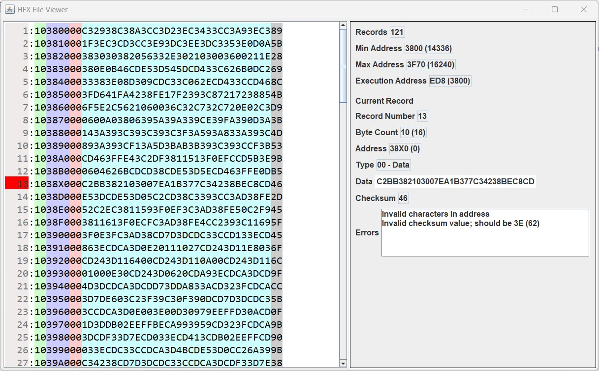

# HEXFileViewer
This is a Java application for viewing .HEX files (used for EEPROM programmers, simulators for computing architectures, loading programs into old monitor applications).

This application is not intended for viewing binary files in hexadecimal. It will only work with .HEX files (also known as Intel hexadecimal object file format, Intel hex format or Intellec Hex). Viewing a HEX file may be useful when using computer simulators, like the Java System Simulator project ( https://github.com/ComputingMongoose/JavaSystemSimulator )

# Usage
Releases are available as Tags: https://github.com/ComputingMongoose/HEXFileViewer/tags

Pre-built jar files are available for each release. The syntax for running the HEX file viewer is:
```
java -jar HEXFileViewer.jar <path_to_hex_file>
```

Be sure to look in the console if there are any errors opening your file.



# HEX file format
HEX files consist of ASCII text lines that are separated by line feed or carriage return characters or both. Each text line contains hexadecimal characters that encode multiple binary numbers. The binary numbers may represent data, memory addresses, or other values, depending on their position in the line and the type and length of the line. Each text line is called a record. Each record contains:
- Start code: the ASCII colon character ':'
- Byte count: number of bytes in the data field
- Address: 16-bit beginning memory address of the data
- Record type: one byte (00=data, 01=end of file, etc.)
- Data: a sequence of Byte count bytes written in hexadecimal
- Checksum: two's complement of the least significant byte (LSB) of the sum of all decoded byte values in the record preceding the checksum.

Read more here: https://en.wikipedia.org/wiki/Intel_HEX

# Youtube

Checkout my YouTube channel for videos about this project: https://www.youtube.com/@ComputingMongoose/


## License

For any part of this work for which the license is applicable, this work is licensed under the [Attribution-NonCommercial-NoDerivatives 4.0 International](http://creativecommons.org/licenses/by-nc-nd/4.0/) license. See LICENSE.CC-BY-NC-ND-4.0.

<a rel="license" href="http://creativecommons.org/licenses/by-nc-nd/4.0/"></a>

Any part of this work that is known to be derived from an existing work is licensed under the license of that existing work. Where such license is known, the license text is included in the LICENSE.ext file, where "ext" indicates the license.

